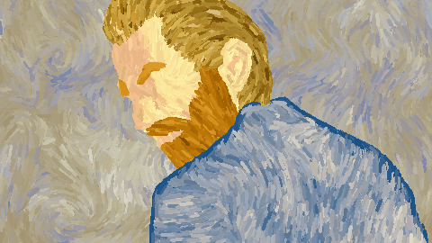
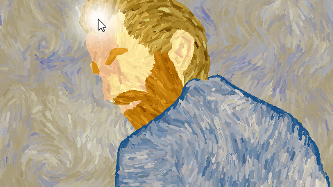
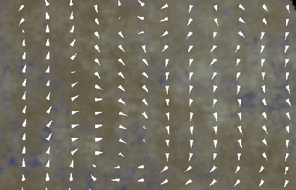

# Flow

## Description
Flow is a tool for creating, editing and visualizing interactive animated paintings.

It is based on a particle engine fully running on GPU.
The particles are displayed as colored paint strokes, and form a painting as they move along an underlying flow map.
The simulation is highly interactive since the flows can be sculpted with the mouse.

This project requires OpenGL 3.3.

## Use

There are two modes: editing mode for creation, and simulation mode.

The mode description is read from a file. Example files are provided.
The program loads the file given as  its first argument, or by default the "setup.txt" file.
Please note that as the file parser uses C++11 `<regex>` which is not fully supported by all compilers, you have to uncomment the `#define` line in the main function to load files.

### Simulation mode
The simulation scene is made of several particle layers drawn on top of each other.
Each particle has a color, an initial position and a lifetime after which it returns to its initial position.

A layer is made of:
* a background image. The RGB channels will be used as colors for the particles.
* a density map, used to sample particles initial positions. The map is read from the alpha channel of the background image.
* a flow map the particles move along
* a number of particles

You can interact with the flow maps using the left mouse button. Each layer is modified independently.
You can use the following shortcuts:
* show/hide background image with B
* show/hide particles with P
* show/hide brush with C
* reset flow maps with R

### Edition mode
The edition mode allows the creation or editing of flow maps.

Flow can be added with left mouse button, and removed with right mouse button.
You can adjust brush size with the mouse wheel.

The flow map can be displayed as an arrow field or as a color map.
The shortcuts are the same than those of the simulation mode, with additionnaly:
* show/hide arrows with A
* show/hide color map with F
* save your work with S. The output file is specified in the scene description file.

## Compilation
This project is written in C++ 11.
It also requires a compiler with full support for C++ `<regex>` classes.
Since I experienced some bugs with an older version of GCC, by default the parser is disabled.
To enable it just uncomment the `#define REGEX_WORK` line in the `main` function.

It uses the following libraries:
* SFML 2.4.2 for window and events management, OpenGL context creation and images loading
* GLM 0.9.8.5
* GLEW 2.1.0
